# Conversación sobre Kepler-51 rings

---

## Mensaje 1
**Autor:** Jorge Zuluaga  
**Fecha:** 25 de febrero de 2026 a las 12:01 p.m.  
**Para:** DAVID SEBASTIAN RODRIGUEZ NUMPAQUE

Hilo con Kipping

---------- Forwarded message ---------

---

## Mensaje 2
**Autor:** Jorge Zuluaga  
**Fecha:** mar, 15 jul 2025 a la(s) 7:44 a.m.  
**Para:** David Kipping

Hey David,

This week a colleague, Jaime Alvarado, from Macquarie University will be visiting our institute. I want to use his visit to go ahead with the manuscript about Kepler-51 puffed planets.

The only thing we need from your side is some information about the fitting you performed on the light-curves of Kepler-51 in order to start from there.

Could you provide us some details about your fitting or let us know if you are using the data for other purposes?

Read you,

---

## Mensaje 3
**Autor:** Jorge Zuluaga  
**Fecha:** vie, 28 feb 2025 a la(s) 10:57 a.m.  
**Para:** David Kipping

Oh! sorry David for the cuts 😰

Let's do it… monday afternoon… send me a Zoom/Meet link a few hours before…

Read you,

---

## Mensaje 4
**Autor:** David Kipping  
**Fecha:** Fri, Feb 28, 2025 at 09:10  
**Para:** Jorge Zuluaga

Hi Jorge,

I think I've lost track of the thread a bit, we have been in crisis mode here with all the funding cuts.

Maybe we could organise a call to catch me up next week? Say Monday afternoon?

David

---

## Mensaje 5
**Autor:** Jorge Zuluaga  
**Fecha:** Jan 21, 2025, at 7:43 PM  
**Para:** David Kipping

Hey David,

What do you think about the results?

I am thinking about starting a draft.

It seems to me that publishing the results of these analyses may offer some alternative scenarios for the nature of Kepler-51 planets and for illustrating how PR effect can be used to seek for exorings hidden into the data.

What do you think?

---

## Mensaje 6
**Autor:** Jorge Zuluaga  
**Fecha:** mié, 15 ene 2025 a la(s) 2:24 p.m.

Interesting to see the actual configuration of the planets in the points of maximum probability:

Planet b:
Experiment 1: Free radius

<image.png>

Experiment 2: Fixed radius (minimum)

<image.png>

---

## Mensaje 7
**Autor:** Jorge Zuluaga  
**Fecha:** mié, 15 ene 2025 a la(s) 9:47 a.m.  
**Para:** David Kipping, Pablo

Hey David and Pablo,

Here are the results of the numerical experiments we have performed so far.

We start with the input posterior distributions for rho_obs as obtained from the fitting by David:

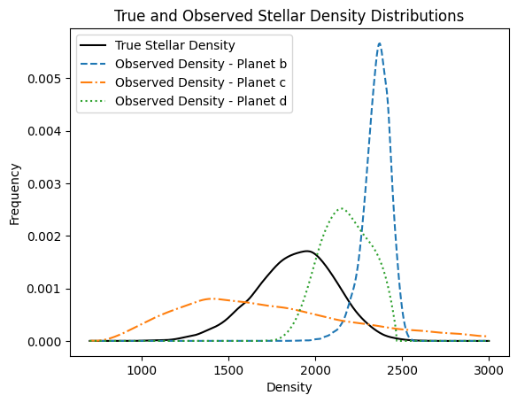

For all planets, the following properties were assumed as "well-known":
- Planetary observed radius Rplanet and its corresponding error. This translates into a transit depth, delta, and its error.
- Orbital period, Porb and its error.

We assume these two properties are the least model dependent of all. Anyone having the light-curves and without a complex analysis may obtain delta and Porb with relatively low uncertainties.

In the absence of a proper statistical information (that in future experiments can be obtained), we assume a fixed value for these properties:
- Impact parameter, b
- Planetary mass Mp. This quantity was used to calculate the "minimum" radius that the planet would have if it had the same density as the Earth, ie. Rpmin = Rearth (Mp/Mearth)^(1/3)

The value of all these quantities and for the three planets were taken from Masuda et al. 2024 as reported in the exoplanet archive (https://exoplanetarchive.ipac.caltech.edu/overview/Kepler-51).

For the stellar mass Mstar and radius Rstar, we assume a bivariate normal distribution with correlation coefficient rho = -0.2 that produce a posterior disribution of rho_true (see below). With this distribution we create a grid of values for Mstar and Rstar for our experiments.

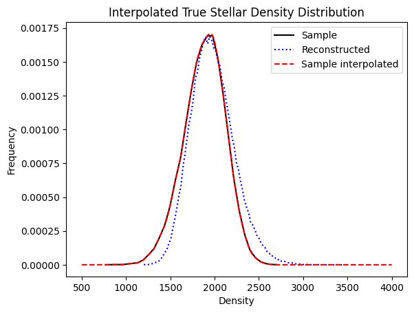

This is the weakest part of the analysis. We are not yet considering the correlation structure of Berger et al. but I think it would not change too much the results.

For each value of the stellar and planetary properties, we calculate at each sample point the following derivative properties:
- Semimajor axis, ap. This depends on Porb and Mstar.
- Orbital inclination, iorb. This depends on b and ap.

### Planet b

#### Experiment 1:
Free parameters: fe (ring external radius in units of planetary radii), Rp (Rplanet in units of Rjupiter), ir (ring inclination respect to orbit), phir (roll angle of the rings)

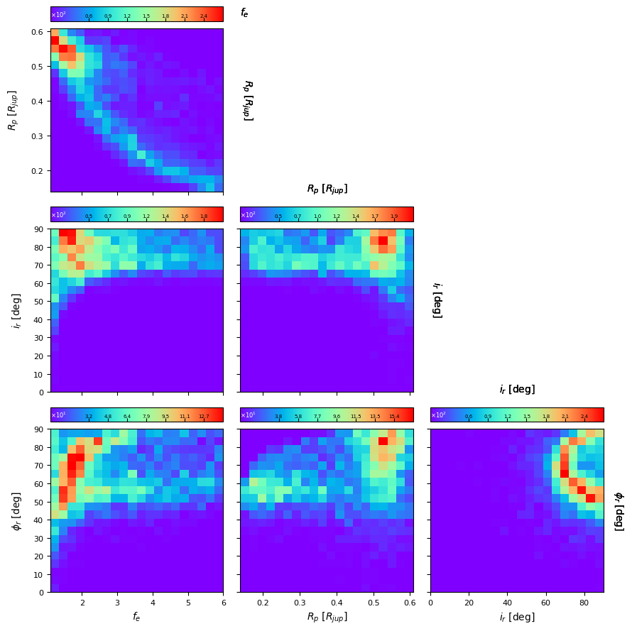

Verification plots: the following plots are intended to verify that the distribution of the key "observed" properties, namely observed stellar density rho_obs, transit depth delta and stellar true density rho_true, follows a similar sample distribution (histogram) as the posteriors.

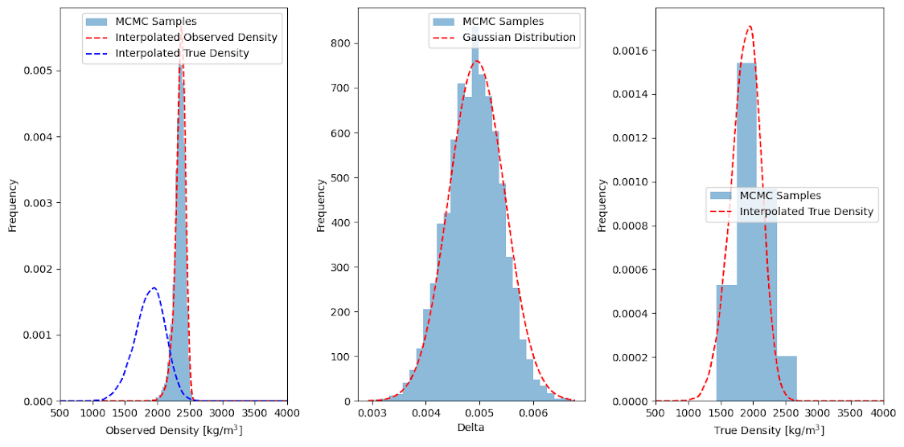

Analysis: when the radius of the planet is freely to change between the minimum (the size of the planet as if it has the same density of Earth) and the maximum (the size of the puffed planet), the analysis produces a solution with a planet which is still puffed (radius a little bit smaller than the actual assumed value) and whose rings are relatively small (fe ~1.5-2). Inclination angles, ir, are relatively steep (70-90), indicating that the solution tends to be simply a large oval-shaped planet. Although we can reconstruct incredibly well the rho_obs posterior with a ringed planet distribution, the solution seems to be favor a puffed ringed-planet. This could be a new planetary category, but it also may be a theoretical artifact.

Below is the same plot as before but using the projected angles, iefff (angle of the ring with respect to the plane of the sky, ieff = 90 when the ring is on the plane of the sky), teff (angle of the ring projected semimajor axis with respect to the orbital trajectory over the star).

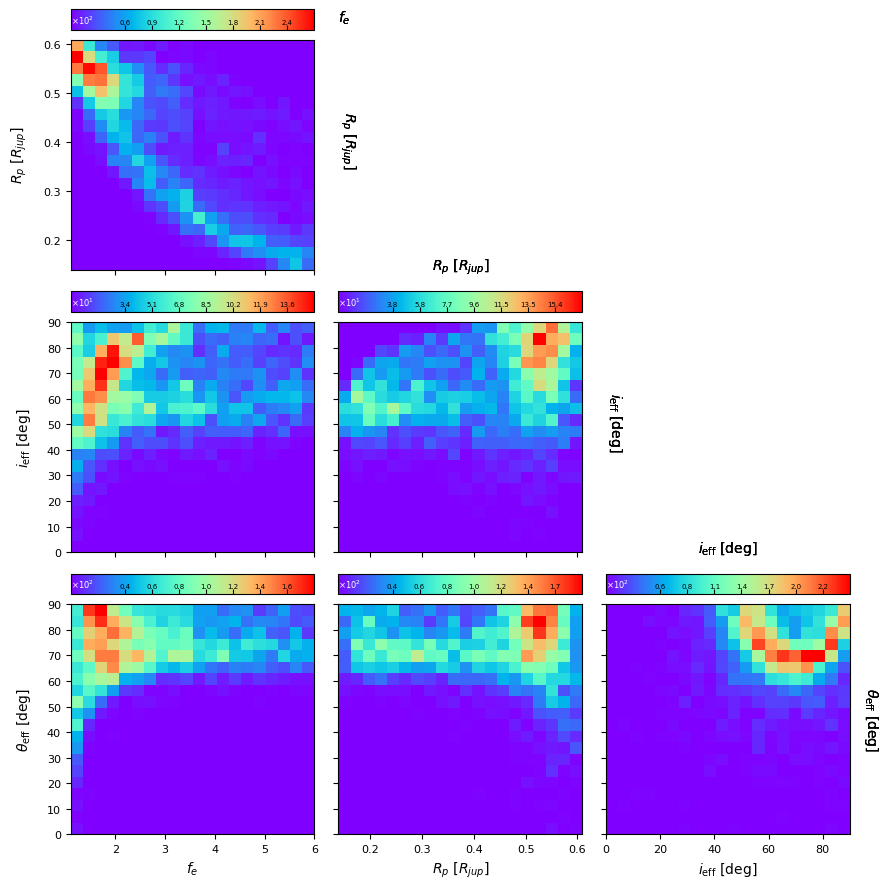

#### Experiment 2:
We fixed the radius of the planet to the minimum (the size of the planet as if it has the same density of Earth) for discarding the case of puffed exoplanets.

Free parameters: fe (ring external radius in units of planetary radii), ir (ring inclination respect to orbit), phir (roll angle of the rings)

Results:

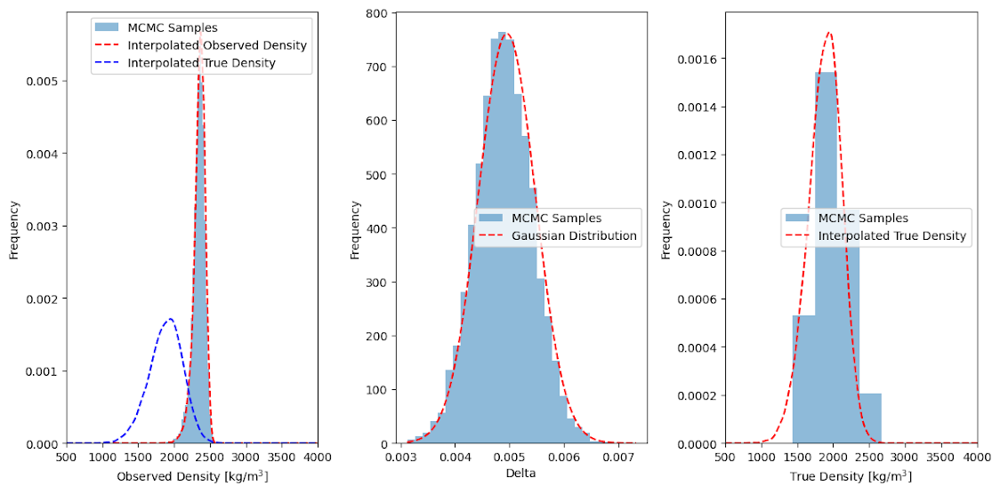

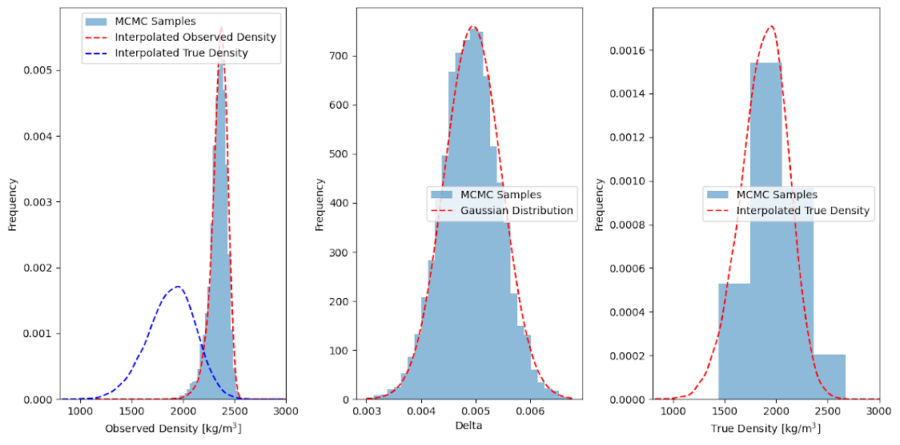

Analysis: the result is beautiful. It indicates that the planet has an extended system of rings, fe ~ 6, with a projected angle (50 degrees) not as unnatural as before.

#### Experiment 3:
Planetary radius fixed to the minimum but now we free the ring opacity which was previously set to 1. We want to study the effect of opacity on the sample distribution.

Free parameters: fe (ring external radius in units of planetary radii), ir (ring inclination respect to orbit), phir (roll angle of the rings)

Results:

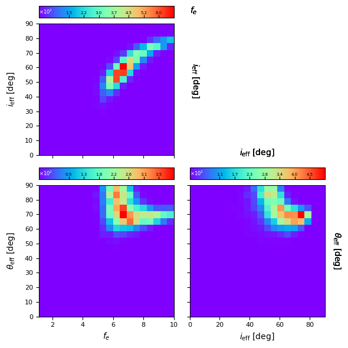

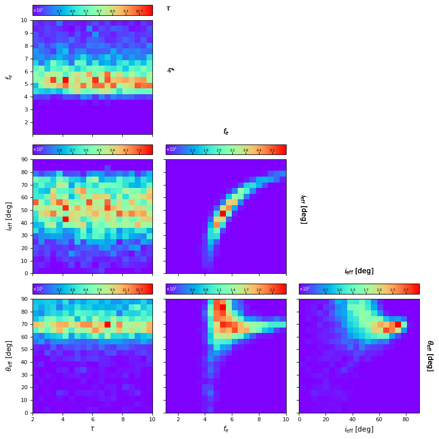

Analysis: It is clear that tau does not impact significantly the previous result, although, as expected, the value of fe is slightly lower for larger values of tau. After this experiment we conclude that using a value tau = 1 is ok for our purposes and works fine if the system of rings (as suggested by these results) are extended and a large average optical depth is not physically reasonable.

### Planet c

#### Experiment 1:

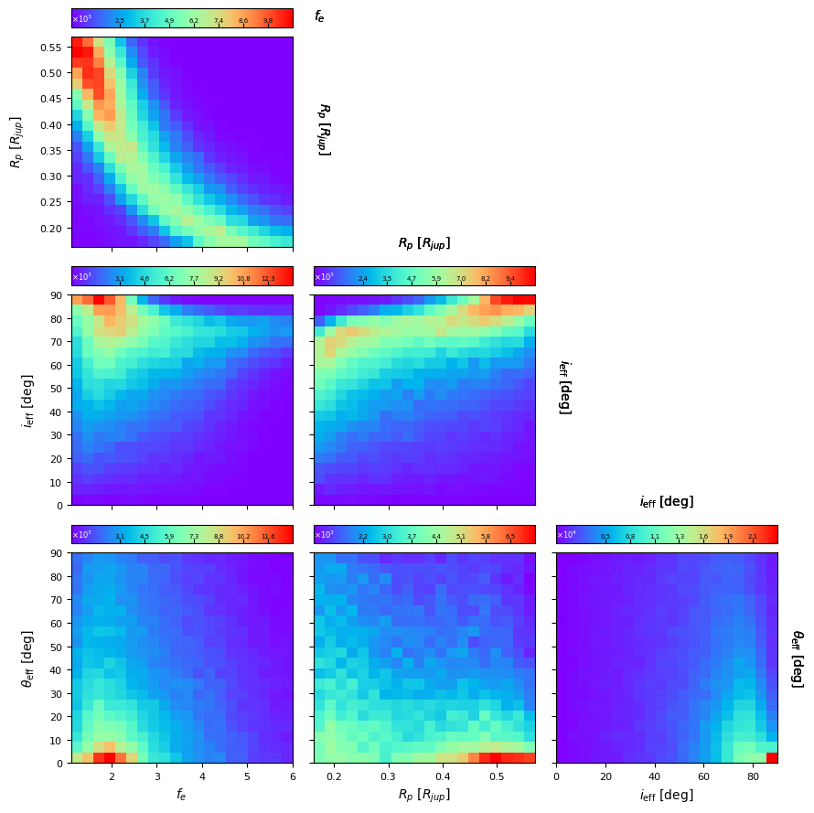

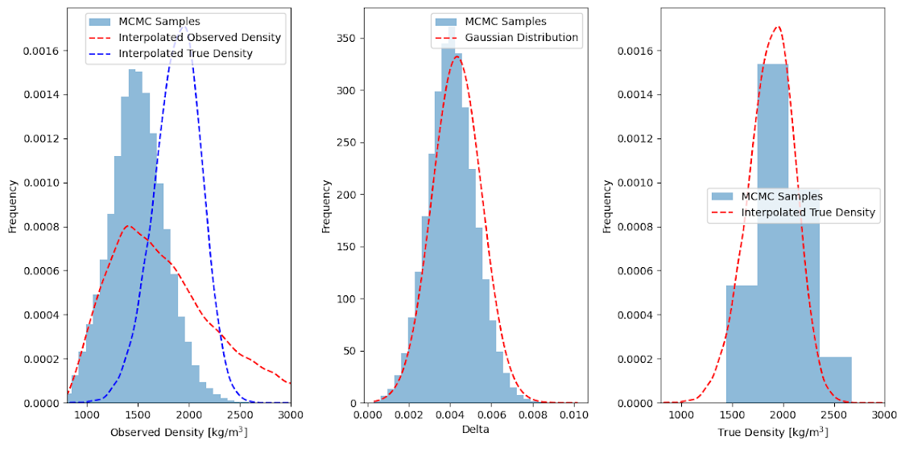

#### Experiment 2:

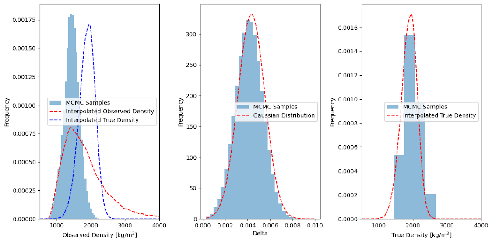

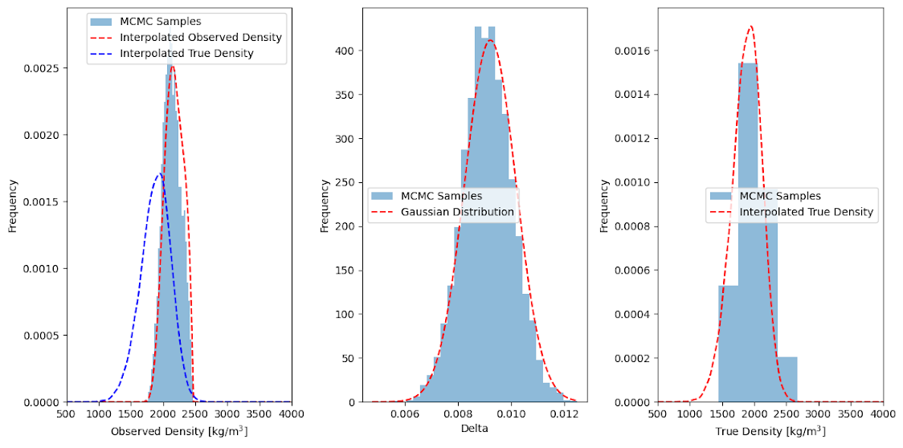

Analysis: It is evident that a ringed planet is worse in this case at explaining the observed stellar densities, either if the planet radius is free to vary, nor if it is fixed to a its minimum value. Moreover, on all these experiments I should put by hand a value of the impact parameter close to 0.72 in order to guarantee that our methods apply, ie. if this planet is grazing, explaining the density anomalies with rings is beyond our present theory of PR. We should extend our theory to grazing ringed exoplanets.

### Planet d

#### Experiment 1:

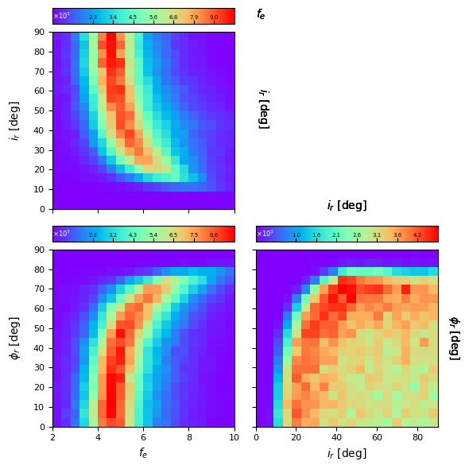

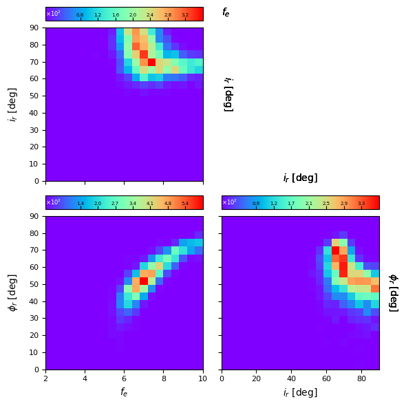

#### Experiment 2:

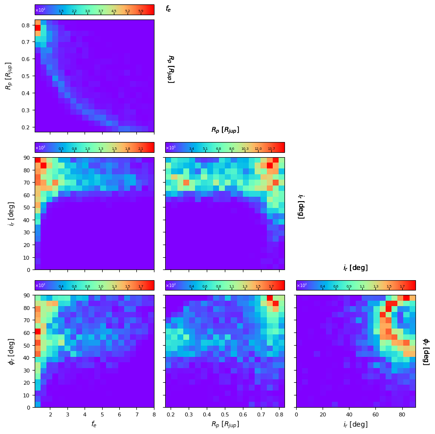

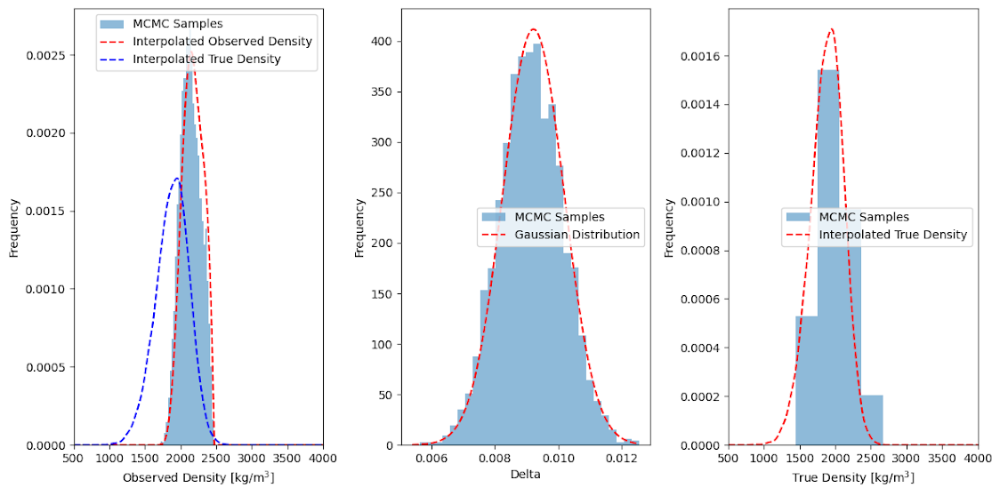

Analysis: this is also a compelling result, that also favor a planet with extended (fe ~ 6-8) rings. Still the ringed planet solution is not as good to reconstruct the observed rho_obs posterior (see the latest plot, left-most panel) as it was in the case of planet b.

### My conclusions so far:
- In all the three planets of the Kepler-51 system, a solution with rings can be found that explains the anomalous observed rho_obs.
- The planet with the most compelling evidence for a ring is planet b, followed by planet d.
- Planet d, being grazing, is a special case that requires an extension of our present PR theory.
- In the cases of planet b and d, the PR theory predicts that if the planets have densities similar to Earth, then the rings are much larger, in relative terms, than those of Saturn.
- If we make the planetary radius a free parameter, the ringed solution tends to favor puffed planets with rings having sizes similar in relative terms to that of Saturn.

### Future directions:
- Fit light curves with the ringed solution and see what the residuals show.

If I have to bet, I would say that planet b is a young Super Earth with a very inclined protolunar disk. And, if joking, I would assign a probability of 10% of winning the bet.

Read you,

---

## Mensaje 8
**Autor:** David Kipping  
**Fecha:** lun, 13 ene 2025 a la(s) 4:30 p.m.  
**Para:** Jorge Zuluaga

Ye as I said in the email, there is consistency in the literature as what people are calling the two planets which is why I added the period labels explicitly

---

## Mensaje 9
**Autor:** Jorge Zuluaga  
**Fecha:** Jan 13, 2025, at 2:53 PM  
**Para:** David Kipping, Pablo

Hey David and Pablo,

We have detected an inconsistency in the data you provide us.

The orbital period of planet c and d are inverted. In your datafile the planet c has an orbital period of 130 days and planet d has an orbital period of 85 days, but it is the other way around.

This may explain why in your file d has b > 1 while c has b ~ 0.25. According to literature the other way around, planet c is the planet which is grazing.

It is a matter of simply inverting the labels in the files.

This is the right labeling:

<image.png>

---

## Mensaje 10
**Autor:** David Kipping  
**Fecha:** sáb, 11 ene 2025 a la(s) 9:37 a.m.  
**Para:** Jorge Zuluaga

Hmm OK, I thought the PR effect was purely in terms of densities?

But sure - if you have to use M* and R* then use Berger's

---

## Mensaje 11
**Autor:** Jorge Zuluaga  
**Fecha:** Jan 11, 2025, at 9:19 AM  
**Para:** David Kipping

That's right... However, in the process of estimating rho_obs for a ringed planet, we need to assume some values for R_\star and M_\star. It is not possible to express everything in terms of \rho_true, especially since our method depends on numerical procedures that depend on orbital period (which are affected by stellar mass), contact times (which are affected by stellar radius) and so on and so forth.

At some point we thought about fixing one of the properties (stellas mass or radius) and express the other one in terms of \rho_true, but we assume that both, radius and mass are actually uncertain.

In the following Colab notebook we describe in detail the algorithm we are devising to estimate ring parameters for this case:
https://drive.google.com/file/d/1-OY-OJUicmfS6FMrZXidJD-8qqUjAbuA/view?usp=sharing

If you have any suggestions or observations, please let us know,

---

## Mensaje 12
**Autor:** David Kipping  
**Fecha:** vie, 10 ene 2025 a la(s) 12:32 p.m.  
**Para:** Jorge Zuluaga

Oh no I'd use the rho star chain from Berger directly. Your approach would inflate the errors since it would ignore covariants structure

---

## Mensaje 13
**Autor:** Jorge Zuluaga  
**Fecha:** Jan 10, 2025, at 11:34  
**Para:** David Kipping

Received!

Great to have all the data...

Concerning the chain of stellar densities, for the purposes of our algorithm, having a chain of radii and masses will be better (I don't know how the density is estimated in Berger et al.)

Our approach for that purpose is fitting a bivariate distribution of R* and M* that reproduce the posterior rho_true.

What do you think?

---

## Mensaje 14
**Autor:** David Kipping  
**Fecha:** vie, 10 ene 2025 a la(s) 10:24 a.m.  
**Para:** Jorge Zuluaga, Pablo

Hi both,

I noticed a bug in my code so re-ran the fits. I think things look much better now. I provide here a Google Drive link to the posteriors for all three planets.

https://drive.google.com/drive/folders/1Eol_4jc9c6fwbNdlRF7_vNQoG_Ztuk9E?usp=sharing

Some notes….
- I think the literature mixes up planets c and d quite a lot, sometimes d is c for example. So I have added the periods explicitly into the folder names to make sure there is no confusion as to what I am calling c and d.
- The c fits include the HST data and that was the bug I found, now fixed.
- You want to open the post-equal weights files for the posteriors. The first 7 columns are as described in my original email. There are additional columns for each transit time which I don't think you need. The last column is log-likelihood which again I don't think you need.
- For planet b, there are too many epochs to fit in a single run (too many dimensions). So I split the Kepler light curve up into 3 segments and hence why you see 3 sets of posteriors in that folder. I then wrote a little MCMC to sample the 3 independent rho* constraints from each segment to create a final posterior chain for rho* from planet b - rhob_samples.dat
- In the root directory, I leave an updated version of the rho* comparison plot. I also uploaded the giant Berger et al. 2023 file I used for the "true" stellar posteriors. To get the PR effect, you need to divide a random sample from the light curve derived posteriors by a random sample of the Berger posteriors. For your convenience, I took the liberty of turning Berger's values into a posterior chain for you, which again is in the root directory as berger2023_rhostar.dat

Let me know if you need anything else and if these files are received OK!

David

---

## Mensaje 15
**Autor:** Jorge Zuluaga  
**Fecha:** Jan 7, 2025, at 4:38 PM  
**Para:** David Kipping

Oh! you're right about the file… we thought you have sent the data for all the planets…

If you have the remaining data (planets b and c, and rho*) it would be great!

Planet b was also pretty surprising to me… we will see what will happen when we include the uncertainty in stellar radius

Another interesting aspect of the system is its short age (500 Myr) which could favor some of the ring formation scenarios, although it is also compatible with puffed early atmospheres

We are including the uncertainty in stellar density and let you know what happens

Read you

---

## Mensaje 16
**Autor:** David Kipping  
**Fecha:** Tue, Jan 7, 2025 at 12:39  
**Para:** Jorge Zuluaga

I think the planet d columns are correct! rho* units had a slight typo and should be kg/m^3 but otherwise it looks correct to me. An unusual aspect I see here is that b>1 and favours a grazing geometry. The HST-only analysis of Libby-Roberts et al. finds b~0.2 so I should revisit this as it is quite surprising.

David

---

## Mensaje 17
**Autor:** Jorge Zuluaga  
**Fecha:** Jan 7, 2025, at 10:41 AM  
**Para:** David Kipping

Hey David,

Great to hear from you...

Sorry for opening another mail thread... let's stick to this one...

1) Let me ask Pablo personally if he is available this week for a telecon and we can plan it...

2) The data you sent us and are resending now didn't contain the distributions. The zip contains two data files, TTVplan-post_equal_weights.dat and TTVplanstats.dat, whose names are not compatible with the information you told us you sent.

These are the average values in the TTVplan-post_equal_weights.dat:

<image.png>

With the exception of column 1, the averages do not coincide with the columns you describe in your original message.

3) According to our first estimations, hypothesis A is very well-supported by the data at least for planet b:

<image.png>

Moreover, we can by using the data, constraint the size and inclination of the rings. The case of planets b and d are not yet clear since we have not taken into account the uncertainty in stellar density.

Read you,

---

## Mensaje 18
**Autor:** David Kipping  
**Fecha:** mar, 7 ene 2025 a la(s) 10:06 a.m.  
**Para:** Jorge Zuluaga

This email chain suggests you have the files OK? If so, perhaps we should schedule a Zoom call so you can walk me through what you have here?

From my perspective, the most interesting question is this…
- It has been claimed that the very low density of the Kepler-51 planets (and indeed other super-puffs) can be explained by undetected rings - let's call that hypothesis A. The PR effect should allow us to constrain the maximum allowed *projected* ring radius. Is this maximum compatible with hypothesis A?

Thanks,

David

---

## 📊 Descripción de las imágenes:

- **kepler51-000.png** - Distribuciones de densidad estelar verdadera y observada para los 3 planetas
- **kepler51-003.png** - Distribución interpolada de densidad estelar verdadera
- **kepler51-004.png** - Planeta b, Experimento 1: Exploración del espacio de parámetros (radio libre)
- **kepler51-005.png** - Planeta b, Experimento 1: Gráficos de verificación
- **kepler51-006.png** - Planeta b, Experimento 1: Ángulos proyectados
- **kepler51-007.png** - Planeta b, Experimento 3: Espacio de parámetros con opacidad
- **kepler51-008.png** - Planeta b, Experimento 2: Espacio de parámetros (radio fijo)
- **kepler51-009.png** - Planeta b, Experimento 3: Gráficos de verificación
- **kepler51-010.png** - Planeta b, Experimento 2: Gráficos de verificación
- **kepler51-011.png** - Planeta c, Experimento 1: Espacio de parámetros
- **kepler51-012.png** - Planeta c, Experimento 1: Gráficos de verificación
- **kepler51-013.png** - Planeta d, Experimento 1: Espacio de parámetros
- **kepler51-014.png** - Planeta c, Experimento 2: Espacio de parámetros
- **kepler51-015.png** - Planeta d, Experimento 2: Espacio de parámetros
- **kepler51-016.png** - Planeta c, Experimento 2: Gráficos de verificación
- **kepler51-017.png** - Planeta d, Experimento 1: Gráficos de verificación
- **kepler51-018.png** - Planeta d, Experimento 2: Gráficos de verificación
